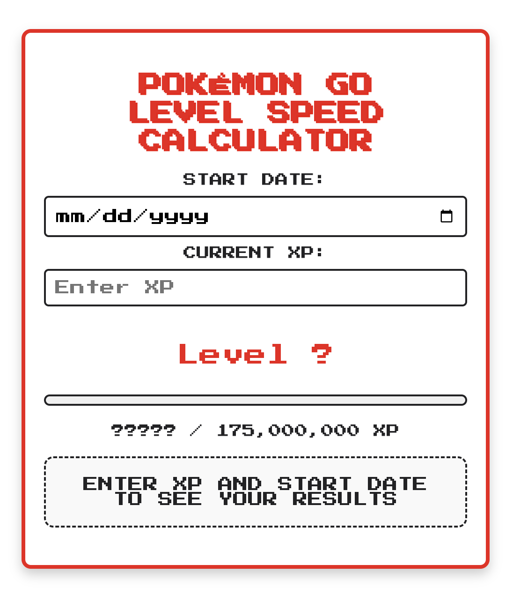

# [lvl50calc](https://a-baranowska.github.io/Pokemonlvl50calc/)
# Pokémon GO Level Speed Calculator

This Pokémon GO Level Speed Calculator is a web-based tool to help players estimate their progress toward reaching level 50. By inputting your total XP and the date you started playing, the calculator determines:

- Your current level
- The average XP you earn per day
- The estimated number of days to reach level 50

---

## Features

- **Dynamic Progress Calculation**: Automatically updates as you enter your XP and start date.
- **Level Determination**: Displays your current level based on your total XP.
- **XP Progress Bar**: Visualizes your progress toward level 50 with an animated bar.
- **Avg Daily XP**: Calculates your average daily XP earnings.
- **Time Estimation**: Calculates how long it will take to reach level 50 based on your current XP rate in days and years.
---

## Usage

1. **Enter Start Date**: Use the date picker to input the date you started playing Pokémon GO.
2. **Enter Current XP**: Input your current XP total.
3. The tool will dynamically calculate:
   - Your current level
   - Average XP per day
   - Estimated time to reach level 50 in days and years

---

## How It Works

- **XP Levels**: The calculator uses predefined XP thresholds for all Pokémon GO levels, from 1 to 50.
- **Level Calculation**: Matches your XP against the thresholds to determine your level.
- **Progress Estimation**:
  - Calculates average XP per day based on the total XP earned and days played.
  - Determines the remaining days required to reach level 50 using the current XP rate.

---

## Level Thresholds

Here is a breakdown of the XP required for each level:

| Level | XP Required | Total XP |
|-------|-------------|----------|
| 1     | 0           | 0        |
| 2     | 1,000       | 1,000    |
| ...   | ...         | ...      |
| 50    | 30,000,000  | 176,000,000 |

(Refer to the code for the complete level breakdown.)

---

## Technologies Used

- **HTML5**: For structure and layout.
- **CSS3**: For styling and responsive design.
- **JavaScript**: For dynamic calculations and user interactions.
- **Google Fonts**: "Press Start 2P" font for a retro Pokémon aesthetic.

---

## How to Run Locally

1. Clone the repository:
   ```bash
   git clone <repository-url>
   ```
2. Navigate to the project directory:
   ```bash
   cd pokemon-go-calculator
   ```
3. Open the `index.html` file in your browser.

---

## Screenshots



---

## Contributing

Contributions are welcome! Please follow these steps:
1. Fork the repository.
2. Create a new branch:
   ```bash
   git checkout -b feature-name
   ```
3. Make your changes and commit:
   ```bash
   git commit -m "Add feature description"
   ```
4. Push to the branch:
   ```bash
   git push origin feature-name
   ```
5. Open a Pull Request.

---

## License

This project is licensed under the  GNU GENERAL PUBLIC LICENSE. See the LICENSE file for details.

---

## Acknowledgments

- Data sourced from Pokémon GO level thresholds.
- Inspired by https://github.com/thomasdondorf/poke-level-calc.git
---


